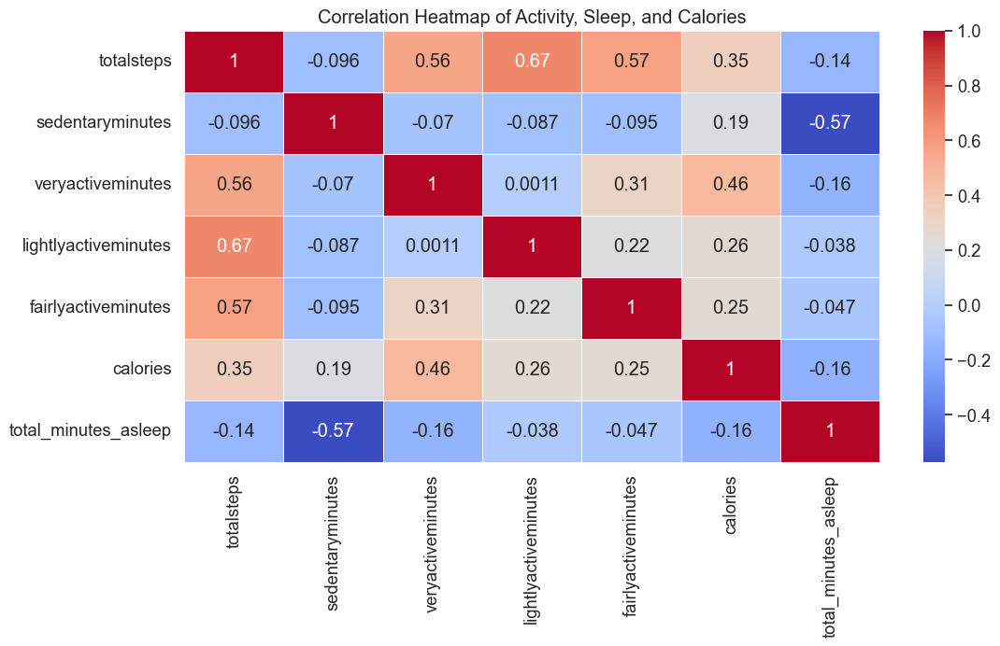
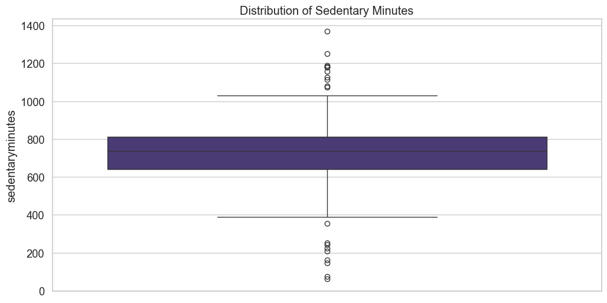
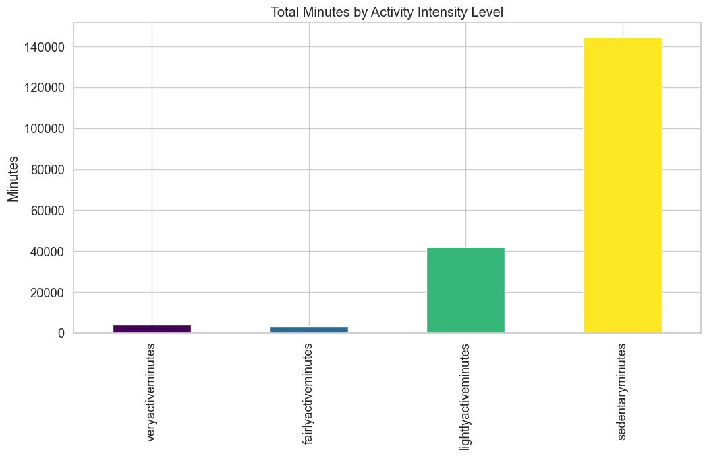
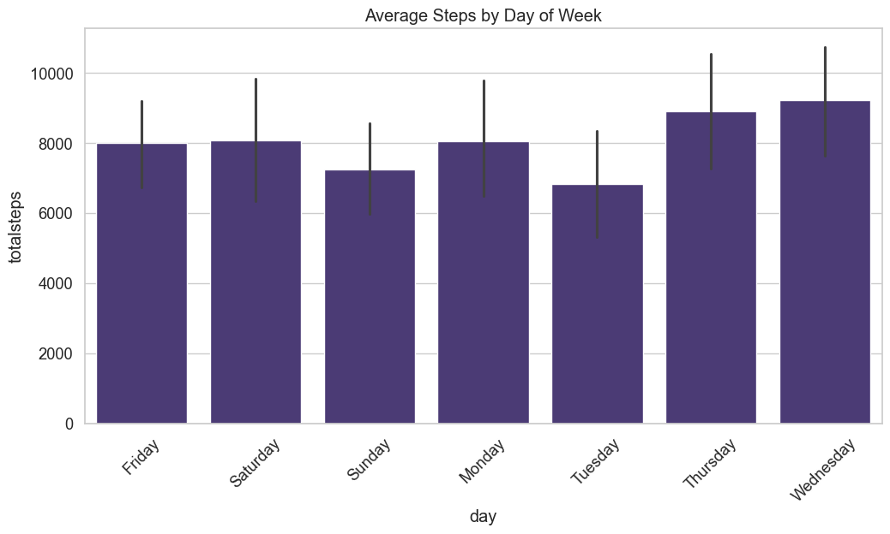
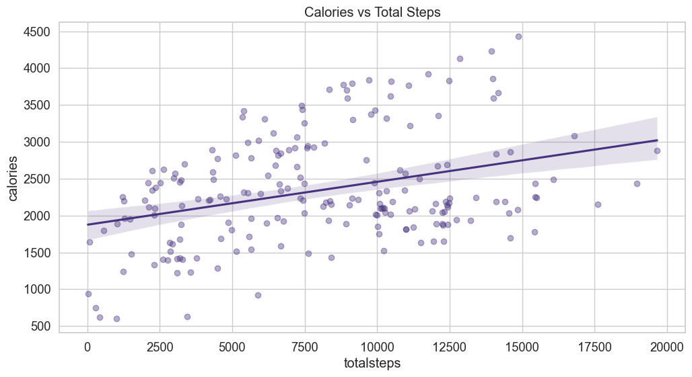
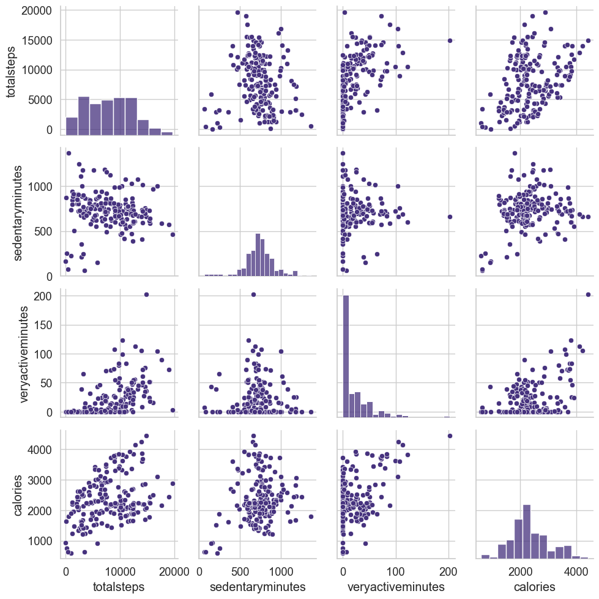

# Korede Bamidele — Portfolio

**Electromechanical Engineer · XR/VR Developer · IoT Maker · UI/UX Designer · AI Enthusiast**

MSc student at the University of Staffordshire, building at the intersection of physical and digital worlds.

[LinkedIn](https://www.linkedin.com/in/kordbam) · [GitHub](https://github.com/KordbamTech) · [Email](mailto:kordbamtech@gmail.com)

---

## Projects

### 🧠 AI & Machine Learning

**[Hybrid Fuzzy–ML Sepsis Prediction](https://github.com/KordbamTech/fuzzy-ml-sepsis-prediction)**
Early ICU septic shock detection combining a Mamdani Fuzzy Inference System with LightGBM.
0.667 F1 score · SHAP explainability · 29% false-positive reduction vs standalone ML.
`Python` `LightGBM` `SHAP` `MATLAB` `Fuzzy Logic`

---

### ⚡ Embedded Systems & DSP

**[STM32F4 Real-Time Signal Monitor](https://github.com/KordbamTech/stm32f4-signal-monitoring)**
Dual-channel ADC signal acquisition at 8 kHz on ARM Cortex-M4, with waveform classification and IIR filter design achieving ~90% arithmetic complexity reduction over FIR baselines.
`C` `STM32` `MISRA-C` `Keil uVision` `MATLAB DSP`

---

### 🥽 XR & VR (Unity)

**Smart Apartment AR** *(coming soon)*
Augmented reality walkthrough of a fully IoT-connected apartment — place, inspect, and control devices in AR.
`Unity` `AR Foundation` `C#` `IoT`

**Smart IoT VR** *(coming soon)*
VR environment to visualise and interact with live IoT sensor data streams.
`Unity` `XR Interaction Toolkit` `C#` `MQTT`

---

### 🌱 IoT & Automation

**[HydroVeg IoT Kit](https://github.com/KordbamTech/hydroveg-iot-kit)**
Automated hydroponics monitoring and control — pH, EC, temperature, and lighting via ESP32 and Node-RED.
`ESP32` `Node-RED` `Python` `MQTT`

---

### 🎨 UI/UX Design (Figma)

**[LAWMA Waste Management App](https://github.com/KordbamTech/lawma-app-design)**
Mobile UI/UX design for Lagos waste management — gamified recycling loyalty rewards, full 5-screen Figma prototype including auth flows, disposal categories, and service booking.
[View prototype →](https://www.figma.com/proto/CLtOGZqaZUtpuU82QVtuEh/My-Portfolio?page-id=0%3A1&node-id=75-8055&scaling=scale-down&content-scaling=fixed&starting-point-node-id=75%3A8055)
`Figma` `Mobile UX` `Prototyping`

**[CWWTechAfrica Chatbot](https://github.com/KordbamTech/cwwtechafrica-chatbot-design)**
Conversational UI chatbot design for CWWTechAfrica — structured message flows, quick-reply chips, and accessible design for a tech education platform across Africa.
[View prototype →](https://www.figma.com/proto/CLtOGZqaZUtpuU82QVtuEh/My-Portfolio?page-id=0%3A1&node-id=75-8055&p=f&viewport=22793%2C-1743%2C0.69&t=8B9B0uMlcTayLUPX-1&scaling=scale-down&content-scaling=fixed&starting-point-node-id=75%3A8055) · [Design file →](https://www.figma.com/design/CLtOGZqaZUtpuU82QVtuEh/My-Portfolio?node-id=75-7973)
`Figma` `Conversational UI` `UX`

---

### 📊 Data Analysis

**Bellabeat Fitness Data Case Study**

Analysed Fitbit data from 30 users to identify behavioural patterns and surface product opportunities for Bellabeat — a smart wellness platform for women.

**Key findings:**

- Users average **7,638 steps/day** — below the 10,000-step health benchmark, signalling an engagement gap
- **81% of tracked time** is sedentary, peaking between 6–8 PM — a prime window for smart nudges
- Sleep and activity are positively correlated, but most users fall short on both
- Calorie burn is strongly tied to step count — simple step prompts would have outsized impact

**Recommendation:** Targeted in-app reminders during the 6–8 PM sedentary window, personalised weekly step goal progression, and a sleep-activity correlation dashboard to increase user retention and health outcomes.

**Visualisations:**

---

### 📱 Mobile

**[Flutter Projects](https://github.com/KordbamTech/flutter-projects)**
Cross-platform Flutter apps — IoT sensor dashboards, engineering field tools, and UI experiments.
`Flutter` `Dart` `BLE` `MQTT`

---

### 🌐 3D Web

**[My Digital Twin](https://github.com/KordbamTech/my-digital-twin)**
Interactive 3D portfolio site built with Babylon.js — a rotating digital globe, orbiting rings, and particle systems. Physical meets digital, in a browser.
`Babylon.js` `TypeScript` `Vite`

---

## Tech Stack

| Domain | Tools |
|--------|-------|
| XR & 3D | Unity, Babylon.js, AR Foundation, C# |
| Embedded | STM32, ESP32, Arduino, MISRA-C, Node-RED |
| AI & Data | Python, LightGBM, SHAP, MATLAB, Power BI |
| Design | Figma (UI/UX, prototyping, component systems) |
| Mobile & Web | Flutter/Dart, TypeScript, Vite |
